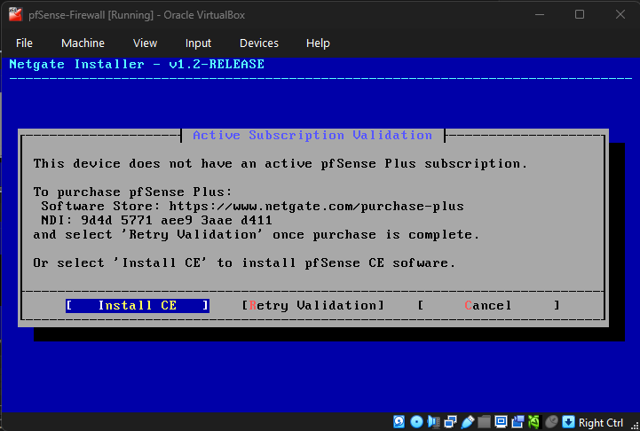
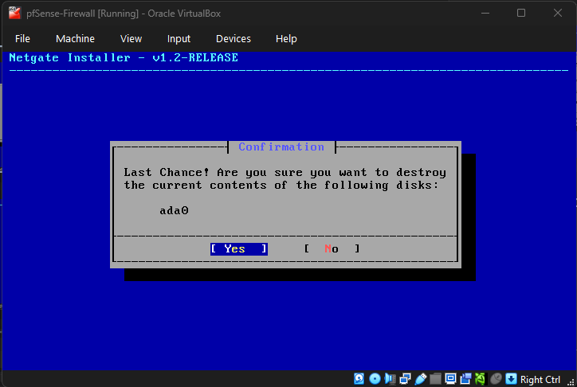
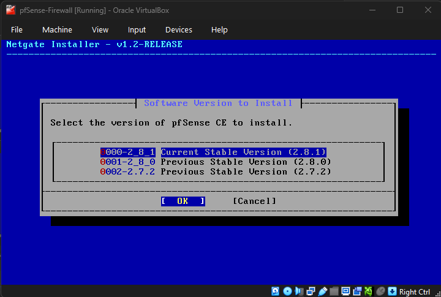
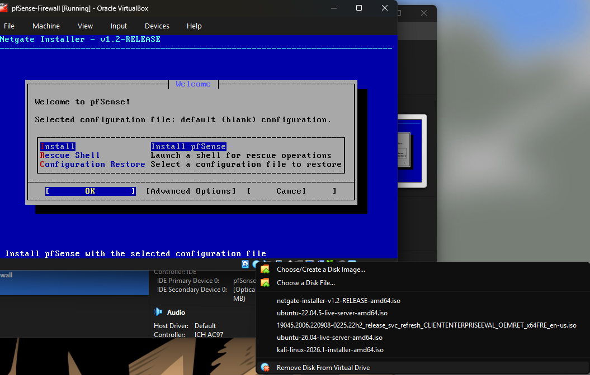
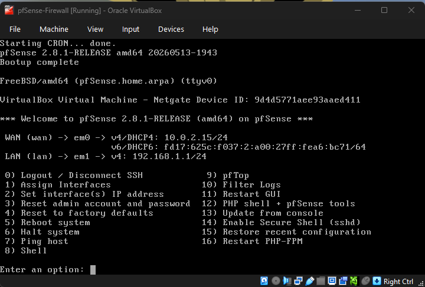
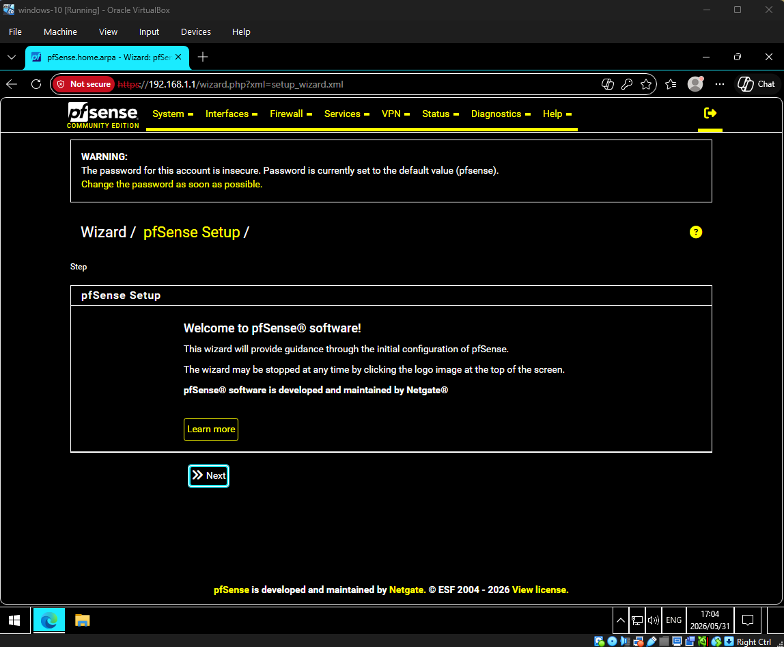
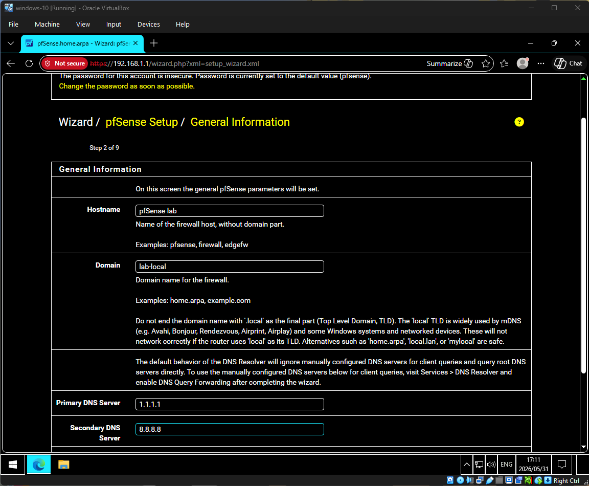
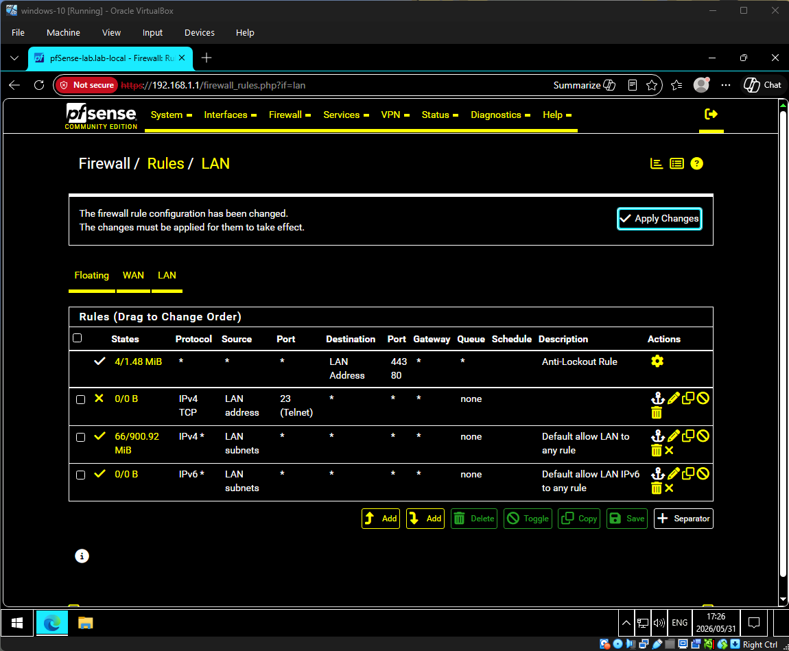
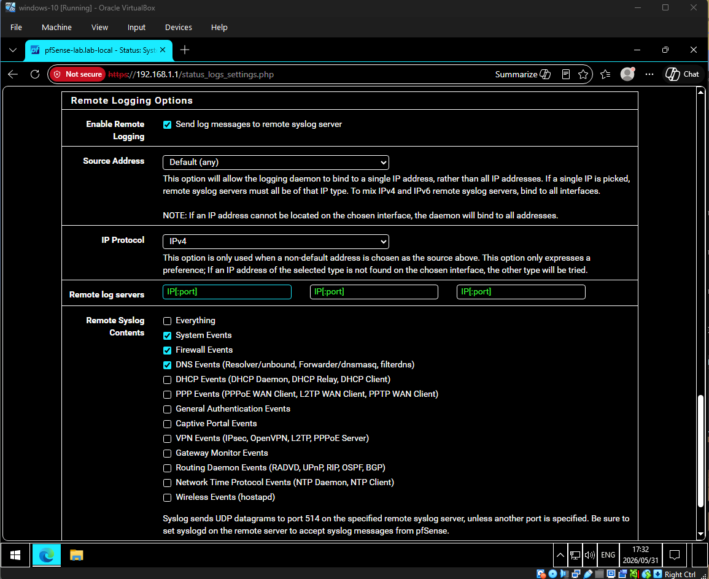

# Installing and Configuring pfSense as a Virtual Firewall

**Date:** 2026-05-31

**Author:** Vadney Da Silva

**Category:** Network Security / Firewall

**Difficulty:** 🟢 Beginner

**Tools Used:** Virtual Box, pfSense CE 2.8.x

---

## 🎯 Objective

Set up pfSense as a virtual firewall in a home lab environment to:

- Understand how a firewall segments and protexts a network.
- Build the foundation of a home SOC lab where pfSense will act as the gateway between the internet and internal VMs (Splunk, Suricata, vulnerable machines).
- Practice configuring firewall rules, interfaces, and logging — core skills for a SOC Analyst.

---

## 🛠️ Lab Environment

| Component | Details |
| --- | --- |
| **Host OS** | FreeBSD |
| **Hypervisor** | Oracle VirtualBox 7.x |
| **Firewall OS** | pfSense CE 2.8.x |
| **RAM Allocated** | 2 GB |
| **CPU Cores** | 2 |
| **Disk Size** | 20 GB |
| **Network Interfaces** | 2 (WAN + LAN) |

## ⚙️ Step-by-Step Installation

### 1️⃣ Step 1: Download pfSense

1. Go to the official site: https://www.pfsense.org/download/


2. Choose/ Select the image type: **AMD64 ISO IPMI/Virtual Machines**

- Add to Cart
- You will have to create an account in order to download it


3. Download then extract the `.iso` file

### 2️⃣ Step 2: Create the pfSense VM in VirtualBox

1. Open VirtualBox → New
2. Configure:
    - **Name:** `pfSense-Firewall`
    - **Type:** BSD
    - **Version:** FreeBSD (64-bit)
    - **RAM:** 2048 MB/ 4096 MB (If you want a faster installation)
    - **CPU:** 2 Cores
    - **Disk:** 20 GB (VDI, dynamically allocated)


### 3️⃣ Step 3: Configure Network Adapters

This is **important**  — pfSense needs two network interfaces:

- Go to the settings (Ctrl + S)
- Select the Network tab


|Adapter	|Purpose	|Type|
| --------- | --------- | ---- |
|Adapter 1	|WAN (Internet-facing)	|NAT|
|Adapter 2	|LAN (Internal lab)	|Internal Network → name it LAB-LAN |

> Note that other virtual machines will be using the LAB-LAN internal network so they can be recognized by pfSense

### 4️⃣ Step 4: Mount the ISO and Boot

1. Make sure the ISO is in the VM: In VirtualBox → **Settings → Storage → Empty CD → Choose pfSense ISO**.
2. Start the VM.
3. Accept the license agreement → choose install **pfSense.**


4. Configure the network → Proceed with the installation


- Since you don’t have the Plus version, “Install CE” → Proceed with the Installation → Confirm the Virtual Hard Disk


- Choose the latest Current Stable (in my case is 2.8.1)

5. Wait until the installation is completed → **Reboot**
6. Once the reboot is done, remove the Virtual Disk, then restart the virtual machine


### 5️⃣ Step 5: Access the pfSense Web GUI

1. Boot up another VM connected to the LAB-LAN network
2. Open the browser → go to:

```
<https://192.168.1.1>
```

3. Default credentials:
    - **Username:** `admin`
    - **Password:** `pfsense`

### 6️⃣ Step 6: Run the Setup Wizard

Walk through the wizard to configure:

- **Hostname:** `pfsense-lab`
- **Domain:** `lab.local`
- **DNS Servers:** `1.1.1.1`, `8.8.8.8`
- **Time Zone:** Your region
- **WAN Configuration:** DHCP (default)
- **LAN Configuration:** `192.168.1.1/24`
- **New Admin Password:** *(set a strong password)*

### 7️⃣ Step 7: Configure a Basic Firewall Rules

Navigate to Firewall → Rules → LAN

- Block All Outbound Telnet (Port 23)

| Action | Interface | Protocol | Source | Destination | Port |
| --- | --- | --- | --- | --- | --- |
| Block | LAN | TCP | LAN net | any | 23 |

> 💡 SOC Insight: Telnet is insecure and often used in older systems. Blocking it reduces attack surface and is a great log source to monitor in Splunk.
>

### 8️⃣ Step 8: Enable Logging

1. Go to **Status → System Logs → Settings**
2. Enable:
    - ✅ Log firewall default blocks
    - ✅ Log packets blocked by floating rules


## 🔍 Findings

- pfSense was successfully installed and configured as a virtual firewall.
- WAN and LAN interfaces are properly segmenting traffic.
- Firewall rules and logging are now active.
- The lab is ready to host additional VMs (Splunk, Suricata, Kali, vulnerable machines) behind pfSense.

## 💡 Lessons Learned

1. **Interface assignment matters** — assigning WAN/LAN incorrectly is the #1 beginner mistake.
2. **Default credentials are dangerous** — always change them immediately (real-world attackers scan for `admin/pfsense`).
3. **Logging is the SOC Analyst's best friend** — without logs, there's no detection.
4. **Network segmentation is foundational** — pfSense lets me practice creating isolated zones (great for simulating attacks safely).

## 🔗 References

- Official pfSense Documentation
- pfSense Download Page
- Professor Messer - Security+ Networking Concepts

## 🏷️ Tags

`#pfSense` `#Firewall` `#HomeLab` `#SOCAnalyst` `#NetworkSecurity` `#BlueTeam`

---

✅ **Lab Status:** Completed